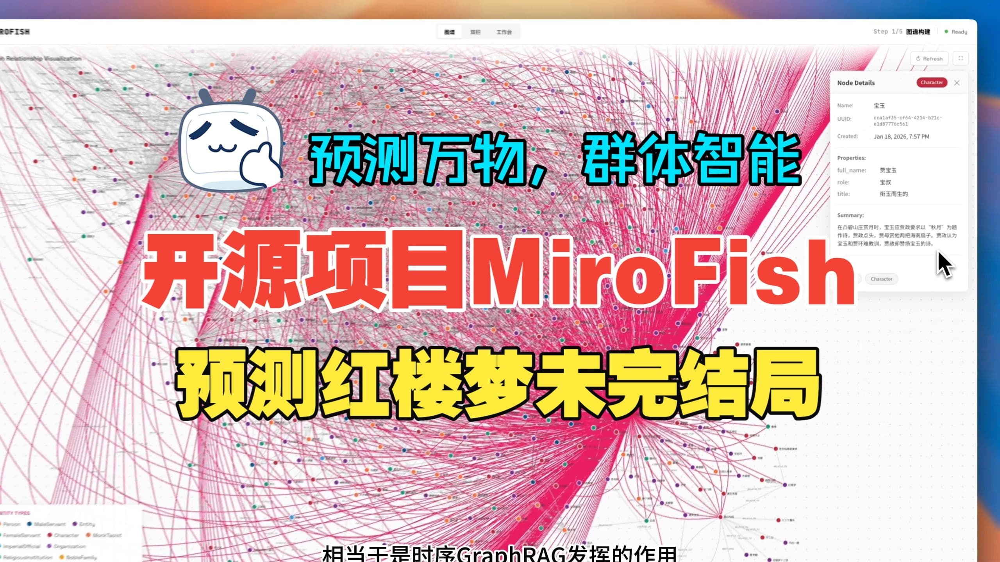

<div align="center">


<a href="https://trendshift.io/repositories/16144" target="_blank"></a>

เครื่องยนต์สติปัญญาหมู่ที่เรียบง่ายและเป็นสากล คาดการณ์ได้ทุกอย่าง
</br>
<em>A Simple and Universal Swarm Intelligence Engine, Predicting Anything</em>

<a href="https://www.shanda.com/" target="_blank"></a>

[](https://github.com/666ghj/MiroFish/stargazers)
[](https://github.com/666ghj/MiroFish/watchers)
[](https://github.com/666ghj/MiroFish/network)
[](https://hub.docker.com/)
[](https://deepwiki.com/666ghj/MiroFish)

[](https://discord.com/channels/1469200078932545606/1469201282077163739)
[](https://x.com/mirofish_ai)
[](https://www.instagram.com/mirofish_ai/)

[English](./README-EN.md) | [ไทย](./README.md)

</div>

## ⚡ ภาพรวมโปรเจกต์

**MiroFish** เป็นเอ็นจิ้น AI คาดการณ์รุ่นใหม่ที่ใช้เทคโนโลยีมัลติเอเจนต์ โดยดึงข้อมูลเมล็ดพันธุ์จากโลกจริง (เช่น ข่าวด่วน ร่างนโยบาย สัญญาณการเงิน) แล้วสร้างโลกดิจิทัลคู่ขนานที่มีความเที่ยงตรงสูง ในพื้นที่นี้ เอเจนต์อัจฉริยะหลายพันตัวที่มีบุคลิก ความทรงจำระยะยาว และตรรกะการกระทำเป็นของตัวเอง จะมีปฏิสัมพันธ์และวิวัฒนาการทางสังคมอย่างอิสระ คุณสามารถฉีดตัวแปรแบบไดนามิกผ่าน "มุมมองพระเจ้า" เพื่อจำลองอนาคตได้อย่างแม่นยำ — **ให้อนาคตถูกซ้อมในแซนด์บ็อกซ์ดิจิทัล ช่วยให้การตัดสินใจชนะหลังการจำลองนับร้อย**

> คุณแค่: อัปโหลดวัสดุเมล็ดพันธุ์ (รายงานวิเคราะห์ข้อมูล หรือเรื่องสั้นที่น่าสนใจ) และอธิบายความต้องการการคาดการณ์ด้วยภาษาธรรมชาติ</br>
> MiroFish จะส่งคืน: รายงานคาดการณ์โดยละเอียด และโลกดิจิทัลความเที่ยงตรงสูงที่โต้ตอบได้ลึก

### วิสัยทัศน์ของเรา

MiroFish มุ่งสร้างกระจกสติปัญญาหมู่ที่สะท้อนความเป็นจริง โดยจับการเกิด emergent จากปฏิสัมพันธ์ของปัจเจก เพื่อก้าวข้ามข้อจำกัดของการคาดการณ์แบบเดิม:

- **ในระดับมหภาค**: เราเป็นห้องแล็บซ้อมสำหรับผู้ตัดสินใจ ให้นโยบายและประชาสัมพันธ์ลองผิดลองถูกโดยความเสี่ยงเป็นศูนย์
- **ในระดับจุลภาค**: เราเป็นแซนด์บ็อกซ์สร้างสรรค์สำหรับผู้ใช้ ไม่ว่าจะจำลองตอนจบนิยายหรือสำรวจไอเดียแปลกๆ ก็สนุก เข้าถึงได้ และทำได้

จากการคาดการณ์เชิงจริงจังถึงการจำลองสนุกๆ เราทำให้ทุก “ถ้า” เห็นผลได้ และทำให้การคาดการณ์ทุกอย่างเป็นไปได้

## 🌐 ทดลองออนไลน์

ยินดีต้อนรับสู่สภาพแวดล้อม Demo ออนไลน์ ลองการจำลองคาดการณ์เหตุการณ์ความเห็นของสาธารณะที่เราเตรียมไว้: [mirofish-live-demo](https://666ghj.github.io/mirofish-demo/)

## 📸 ภาพหน้าจอระบบ

<div align="center">
<table>
<tr>
<td></td>
<td></td>
</tr>
<tr>
<td></td>
<td></td>
</tr>
<tr>
<td></td>
<td></td>
</tr>
</table>
</div>

## 🎬 วิดีโอสาธิต

### 1. การจำลองคาดการณ์ความเห็นของสาธารณะ Wuhan University + อธิบายโปรเจกต์ MiroFish

<div align="center">
<a href="https://www.bilibili.com/video/BV1VYBsBHEMY/" target="_blank"></a>

คลิกภาพเพื่อดูวิดีโอสาธิตเต็มของการคาดการณ์ด้วยรายงานความเห็น Wuhan University ที่สร้างโดย微舆BettaFish
</div>

### 2. การจำลองคาดการณ์ตอนจบที่สูญหายของ "ความฝันในหอแดง"

<div align="center">
<a href="https://www.bilibili.com/video/BV1cPk3BBExq" target="_blank"></a>

คลิกภาพเพื่อดูการคาดการณ์ตอนจบที่สูญหายโดย MiroFish จากข้อความหลายแสนคำ 80 ตอนแรกของ "ความฝันในหอแดง"
</div>

> ตัวอย่าง **การจำลองคาดการณ์ด้านการเงิน**, **การจำลองคาดการณ์ข่าวการเมือง** ฯลฯ จะอัปเดตเรื่อยๆ...

## 🔄 ขั้นตอนการทำงาน

1. **สร้างกราฟ**: ดึงเมล็ดพันธุ์จากความเป็นจริง & ฉีดความทรงจำปัจเจกและหมู่ & สร้าง GraphRAG
2. **เตรียมสภาพแวดล้อม**: ดึงความสัมพันธ์เอนทิตี & สร้างบุคลิก & ฉีดพารามิเตอร์จำลองผ่าน Agent ตั้งค่าสภาพแวดล้อม
3. **เริ่มจำลอง**: จำลองแบบขนานสองแพลตฟอร์ม & แยกความต้องการคาดการณ์อัตโนมัติ & อัปเดตความทรงจำเชิงเวลาแบบไดนามิก
4. **สร้างรายงาน**: ReportAgent มีชุดเครื่องมือหลากหลายและโต้ตอบลึกกับสภาพแวดล้อมหลังจำลอง
5. **โต้ตอบลึก**: สนทนากับใครก็ได้ในโลกจำลอง & สนทนากับ ReportAgent

## 🚀 เริ่มต้นอย่างรวดเร็ว

### หนึ่ง、การติดตั้งจากซอร์สโค้ด (แนะนำ)

#### ความต้องการเบื้องต้น

| เครื่องมือ | เวอร์ชันที่ต้องการ | หมายเหตุ | ตรวจสอบการติดตั้ง |
|------|---------|------|---------|
| **Node.js** | 18+ | สภาพแวดล้อมรัน frontend รวม npm | `node -v` |
| **Python** | ≥3.11, ≤3.12 | สภาพแวดล้อมรัน backend | `python --version` |
| **uv** | เวอร์ชันล่าสุด | ตัวจัดการแพ็กเกจ Python | `uv --version` |

#### 1. ตั้งค่าตัวแปรสภาพแวดล้อม

```bash
# คัดลอกไฟล์ตัวอย่างการตั้งค่า
cp .env.example .env

# แก้ไขไฟล์ .env แล้วใส่ API key ที่จำเป็น
```

**ตัวแปรสภาพแวดล้อมที่จำเป็น:**

```env
# LLM API (รองรับ OpenAI หรือ API ที่ใช้รูปแบบ OpenAI ได้)
# ตัวเลือกที่รองรับ:
#   - OpenAI เช่น gpt-4o-mini: https://platform.openai.com/ (ค่าใน .env.example ใช้ตัวนี้)
#   - Alibaba Bailian qwen-plus: https://bailian.console.aliyun.com/ (การใช้งานสูง ลองจำลองน้อยกว่า 40 รอบก่อน)
LLM_API_KEY=your_api_key
LLM_BASE_URL=https://api.openai.com/v1
LLM_MODEL_NAME=gpt-4o-mini

# Zep Cloud
# โควตาฟรีรายเดือนเพียงพอสำหรับการใช้งานพื้นฐาน: https://app.getzep.com/
ZEP_API_KEY=your_zep_api_key
```

#### 2. ติดตั้ง dependencies

```bash
# ติดตั้ง dependencies ทั้งหมดในคำสั่งเดียว (รูท + frontend + backend)
npm run setup:all
```

หรือติดตั้งแยกขั้นตอน:

```bash
# ติดตั้ง Node dependencies (รูท + frontend)
npm run setup

# ติดตั้ง Python dependencies (backend สร้าง virtual environment อัตโนมัติ)
npm run setup:backend
```

#### 3. เริ่มบริการ

```bash
# เริ่ม frontend และ backend พร้อมกัน (รันที่รูทโปรเจกต์)
npm run dev
```

**ที่อยู่บริการ:**
- Frontend: `http://localhost:3000`
- Backend API: `http://localhost:5001`

**เริ่มแยก:**

```bash
npm run backend   # เริ่มเฉพาะ backend
npm run frontend  # เริ่มเฉพาะ frontend
```

### สอง、การติดตั้งด้วย Docker

```bash
# 1. ตั้งค่าตัวแปรสภาพแวดล้อม (เหมือนการติดตั้งจากซอร์ส)
cp .env.example .env

# 2. ดึงอิมเมจและเริ่ม
docker compose up -d
```

โดยค่าเริ่มต้นจะอ่าน `.env` ที่รูทโปรเจกต์ และแมปพอร์ต `3000 (frontend) / 5001 (backend)`

> ใน `docker-compose.yml` มีที่อยู่ mirror เร่งความเร็วในคอมเมนต์ แทนที่ได้ตามต้องการ

## 📬 ติดต่อและชุมชน

<div align="center">

</div>

&nbsp;

ทีม MiroFish รับสมัครพนักงานเต็มเวลา/ฝึกงานอย่างต่อเนื่อง หากสนใจแอปพลิเคชันมัลติเอเจนต์ ส่งเรซูเม่ได้ที่: **mirofish@shanda.com**

## 📄 ขอบคุณ

**MiroFish ได้รับการสนับสนุนเชิงกลยุทธ์และบ่มเพาะจาก Shanda Group!**

เอ็นจิ้นจำลองของ MiroFish ขับเคลื่อนโดย **[OASIS](https://github.com/camel-ai/oasis)** เราขอขอบคุณทีม CAMEL-AI สำหรับการเปิดซอร์ส!

## 📈 สถิติโปรเจกต์

<a href="https://www.star-history.com/#666ghj/MiroFish&type=date&legend=top-left">
 <picture>
   <source media="(prefers-color-scheme: dark)" srcset="https://api.star-history.com/svg?repos=666ghj/MiroFish&type=date&theme=dark&legend=top-left" />
   <source media="(prefers-color-scheme: light)" srcset="https://api.star-history.com/svg?repos=666ghj/MiroFish&type=date&legend=top-left" />
   
 </picture>
</a>
