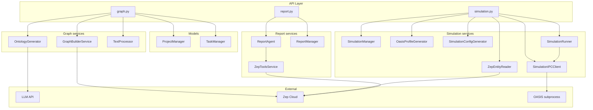
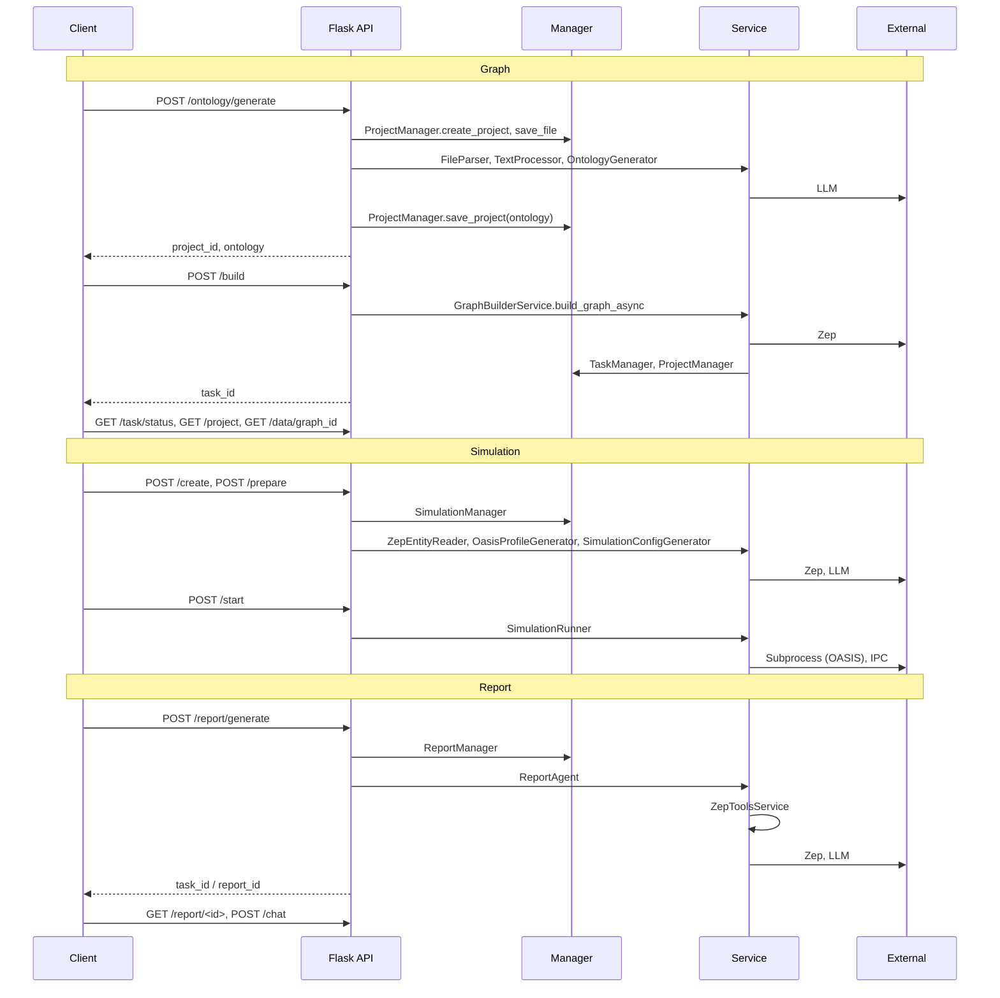

# MiroFish Backend — Summary

Backend is a **Flask** app (Python 3.11+) that:

1. **Graph:** Accepts document uploads, generates an ontology via LLM, and builds a knowledge graph in **Zep Cloud**.
2. **Simulation:** Prepares OASIS agent profiles from the graph, generates simulation config, and runs **Twitter + Reddit** simulations in a subprocess with **IPC**.
3. **Report:** Generates analysis reports via a **Report Agent** that uses **Zep tools** (search, insight, panorama, interview) and LLM.

---

## Entry point & layout

```text
backend/
├── run.py                 # Entry: Config.validate(), create_app(), app.run(host, port)
├── pyproject.toml         # Dependencies (Flask, openai, zep-cloud, camel-oasis, etc.)
├── app/
│   ├── __init__.py        # create_app(): Flask, CORS, blueprints, /health
│   ├── config.py          # Config from .env (LLM, Zep, uploads, OASIS, report)
│   ├── api/               # Blueprints: graph_bp, simulation_bp, report_bp
│   ├── models/            # Project, Task; ProjectManager, TaskManager
│   ├── services/          # Business logic (ontology, graph, simulation, report, zep)
│   └── utils/             # LLMClient, file_parser, logger, retry, zep_paging
├── scripts/               # OASIS simulation scripts (run_parallel_simulation, etc.)
└── uploads/               # Projects, simulations, reports (created at runtime)
```

**Start:** From repo root, `npm run backend` (or `cd backend && uv run python run.py`). Reads `.env` at project root; serves on port **5001** by default.

---

## Configuration (`app/config.py`)

Loaded from project root **`.env`** (via `load_dotenv`).

| Variable | Purpose |
|----------|---------|
| `LLM_API_KEY`, `LLM_BASE_URL`, `LLM_MODEL_NAME` | LLM API (OpenAI or compatible). Default in `.env.example`: OpenAI `gpt-4o-mini`. Alternative: Alibaba Bailian `qwen-plus` (see `.env.example`). |
| `ZEP_API_KEY` | Zep Cloud (graph + memory). |
| `SECRET_KEY`, `FLASK_DEBUG`, `FLASK_HOST`, `FLASK_PORT` | Flask app. |
| `MAX_CONTENT_LENGTH`, `UPLOAD_FOLDER`, `ALLOWED_EXTENSIONS` | File upload (e.g. 50MB, pdf/md/txt). |
| `DEFAULT_CHUNK_SIZE`, `DEFAULT_CHUNK_OVERLAP` | Text chunking for graph build. |
| `OASIS_DEFAULT_MAX_ROUNDS`, `OASIS_SIMULATION_DATA_DIR` | Simulation run. |
| `OASIS_TWITTER_ACTIONS`, `OASIS_REDDIT_ACTIONS` | Allowed action types. |
| `REPORT_AGENT_MAX_TOOL_CALLS`, `REPORT_AGENT_MAX_REFLECTION_ROUNDS`, `REPORT_AGENT_TEMPERATURE` | Report Agent behavior. |

`Config.validate()` checks required keys (e.g. `LLM_API_KEY`, `ZEP_API_KEY`); `run.py` exits with errors if validation fails.

---

## API Blueprints

Registered in `app/__init__.py`:

| Blueprint | Prefix | Role |
|-----------|--------|------|
| `graph_bp` | `/api/graph` | Project CRUD, ontology generation, graph build, task status, graph data. |
| `simulation_bp` | `/api/simulation` | Entities from graph, create/prepare/start/stop simulation, profiles, config, run-status, actions, timeline, interview, env close. |
| `report_bp` | `/api/report` | Generate report (async), status, get/download report, chat, tools, logs. |

Health: `GET /health` → `{ status: 'ok', service: 'MiroFish Backend' }`.

---

## API routes (summary)

### `/api/graph` (graph + project)

| Method | Route | Description |
|--------|--------|-------------|
| GET | `/project/<project_id>` | Get project. |
| GET | `/project/list` | List projects. |
| DELETE | `/project/<project_id>` | Delete project. |
| POST | `/project/<project_id>/reset` | Reset to re-build graph. |
| POST | `/ontology/generate` | Upload files + simulation_requirement → create project, extract text, LLM ontology → save project. |
| POST | `/build` | Start async graph build (Zep); returns task_id. |
| GET | `/task/<task_id>/status` | Poll graph build task. |
| GET | `/data/<graph_id>` | Get graph nodes/edges (for frontend). |

### `/api/simulation`

| Method | Route | Description |
|--------|--------|-------------|
| GET | `/entities/<graph_id>` | Filtered entities from Zep (by ontology types). |
| GET | `/entities/<graph_id>/<entity_uuid>` | Single entity detail. |
| GET | `/entities/<graph_id>/by-type/<entity_type>` | Entities by type. |
| POST | `/create` | Create simulation (project_id, graph_id). |
| POST | `/prepare` | Prepare: read entities, generate profiles + config. |
| POST | `/prepare/status` | Poll prepare task. |
| GET | `/<simulation_id>` | Get simulation state. |
| GET | `/list` | List simulations. |
| POST | `/start` | Start OASIS run (subprocess + IPC). |
| POST | `/stop` | Request stop (IPC). |
| GET | `/<simulation_id>/run-status` | Current run status. |
| GET | `/<simulation_id>/actions`, `/timeline`, `/posts`, `/comments` | Run data. |
| POST | `/interview` | Send message to one agent (IPC). |
| POST | `/env-status` | Check subprocess env. |
| POST | `/close-env` | Close subprocess. |

### `/api/report`

| Method | Route | Description |
|--------|--------|-------------|
| POST | `/generate` | Start async report generation (returns task_id or report_id). |
| POST | `/generate/status` | Poll generate task. |
| GET | `/<report_id>` | Get report meta + content. |
| GET | `/by-simulation/<simulation_id>` | Get report by simulation. |
| GET | `/<report_id>/download` | Download file. |
| POST | `/chat` | Chat with Report Agent (report_id + message). |
| GET | `/<report_id>/sections`, `/section/<index>` | Section content. |
| GET | `/<report_id>/tools/search`, `/tools/statistics` | Direct tool calls for debugging. |

---

## Models (`app/models/`)

### Project (`project.py`)

- **Project:** dataclass — project_id, name, status, files, total_text_length, ontology, analysis_summary, graph_id, graph_build_task_id, simulation_requirement, chunk_size/chunk_overlap, error.
- **ProjectStatus:** created → ontology_generated → graph_building → graph_completed | failed.
- **ProjectManager:** singleton-like; persists under `uploads/projects/<project_id>/project.json`; methods: create_project, get_project, save_project, list_projects, delete_project, save_file_to_project, save_extracted_text, etc.

### Task (`task.py`)

- **Task:** dataclass — task_id, task_type, status, progress, message, result, error, metadata.
- **TaskStatus:** pending → processing → completed | failed.
- **TaskManager:** singleton, in-memory thread-safe store; create_task, get_task, update_task (status, progress, result). Used for graph build and report generation async tasks.

---

## Services (`app/services/`)

### Graph pipeline

| Service | File | Role |
|---------|------|------|
| **OntologyGenerator** | `ontology_generator.py` | Calls LLM to produce entity_types + edge_types (JSON) from documents and simulation_requirement. |
| **GraphBuilderService** | `graph_builder.py` | Chunks text, sends to Zep Cloud to create/ingest graph from ontology; runs in background thread; updates TaskManager and ProjectManager. |
| **TextProcessor** | `text_processor.py` | Preprocesses text (clean, normalize) before ontology/graph. |

### Zep & graph

| Service | File | Role |
|---------|------|------|
| **ZepEntityReader** | `zep_entity_reader.py` | Reads entities (and optional edges) from Zep for a graph_id; filters by ontology entity types; returns FilteredEntities / EntityNode. |
| **ZepToolsService** | `zep_tools.py` | Tools for Report Agent: QuickSearch, InsightForge (multi-query), PanoramaSearch (broad), Interview (agent chat). Uses Zep client + LLM where needed. |
| **ZepGraphMemoryManager** / **ZepGraphMemoryUpdater** | `zep_graph_memory_updater.py` | Writes agent activities (posts, likes, etc.) back into Zep graph (episodes/facts) after simulation run. |

### Simulation pipeline

| Service | File | Role |
|---------|------|------|
| **SimulationManager** | `simulation_manager.py` | In-memory (or file-backed) SimulationState; create, get, list, update; status: created → preparing → ready → running → stopped/completed/failed. |
| **OasisProfileGenerator** | `oasis_profile_generator.py` | For each entity from Zep, calls LLM to generate OASIS agent profile (name, role, style, etc.) for Twitter/Reddit scripts. |
| **SimulationConfigGenerator** | `simulation_config_generator.py` | Calls LLM to generate simulation parameters (rounds, time per round, platform toggles, etc.) from simulation_requirement. |
| **SimulationRunner** | `simulation_runner.py` | Spawns OASIS subprocess (e.g. run_parallel_simulation.py), passes config; SimulationIPCClient to send commands (e.g. stop, interview) and read status/actions; ZepGraphMemoryManager to push actions to Zep; RunnerStatus: idle → starting → running → stopping → stopped/completed/failed. |
| **SimulationIPCClient** / **SimulationIPCServer** | `simulation_ipc.py` | File-based IPC: Flask writes commands to `commands/`, script reads and writes responses to `responses/`. Command types: interview, batch_interview, close_env. |

### Report pipeline

| Service | File | Role |
|---------|------|------|
| **ReportAgent** | `report_agent.py` | Plans report outline (sections), then for each section runs ReACT loop with ZepToolsService (Search, InsightForge, Panorama, Interview) and LLM to write content; logs to ReportLogger. |
| **ReportManager** | `report_agent.py` | Persists Report (report_id, simulation_id, status, sections, path) under uploads/reports/<report_id>; get_report, get_report_by_simulation, list, delete. |

---

## Utils (`app/utils/`)

| Module | Role |
|--------|------|
| **llm_client.py** | LLMClient: OpenAI client (api_key, base_url, model); chat(), chat_json(). |
| **file_parser.py** | Extract text from PDF (PyMuPDF), MD, TXT; encoding fallback (UTF-8, charset_normalizer, chardet). |
| **logger.py** | setup_logger, get_logger (per module). |
| **retry.py** | Retry decorator for transient failures. |
| **zep_paging.py** | fetch_all_nodes, fetch_all_edges (paginate Zep API). |

---

## Scripts (`scripts/`)

Run by **SimulationRunner** as subprocesses; communicate via IPC.

| Script | Role |
|--------|------|
| **run_parallel_simulation.py** | Orchestrates Twitter + Reddit simulations (camel-oasis); reads config/profiles from SimulationRunner; polls IPC for commands (interview, close_env); writes run status/actions back. |
| **run_twitter_simulation.py** | Twitter platform simulation. |
| **run_reddit_simulation.py** | Reddit platform simulation. |
| **action_logger.py** | Logs agent actions (for debugging / replay). |
| **test_profile_format.py** | Tests OASIS profile format. |

---

## Backend internal flow (high level)



---

## Request flow by domain



---

## Dependencies (from pyproject.toml)

- **Flask**, **flask-cors** — Web server.
- **openai** — LLM client (OpenAI-compatible).
- **zep-cloud** — Zep Cloud client (graph + memory).
- **camel-oasis**, **camel-ai** — OASIS social simulation.
- **PyMuPDF**, **charset-normalizer**, **chardet** — File parsing and encoding.
- **python-dotenv**, **pydantic** — Config and validation.

---

## Summary table: where is what?

| What | Where |
|------|--------|
| App creation, CORS, blueprints | `app/__init__.py` |
| Config, env | `app/config.py` |
| Project CRUD, ontology, graph build, task poll, graph data | `app/api/graph.py` |
| Entities, simulation create/prepare/start/stop, interview, env | `app/api/simulation.py` |
| Report generate, get, chat, tools | `app/api/report.py` |
| Project persistence | `app/models/project.py` |
| Async task state | `app/models/task.py` |
| Ontology from LLM | `app/services/ontology_generator.py` |
| Zep graph build | `app/services/graph_builder.py` |
| Entities from Zep | `app/services/zep_entity_reader.py` |
| Report Agent + Zep tools | `app/services/report_agent.py`, `zep_tools.py` |
| OASIS profiles & config | `app/services/oasis_profile_generator.py`, `simulation_config_generator.py` |
| Run OASIS + IPC | `app/services/simulation_runner.py`, `simulation_ipc.py` |
| Write actions to Zep | `app/services/zep_graph_memory_updater.py` |
| LLM calls | `app/utils/llm_client.py` |
| File upload & text extraction | `app/utils/file_parser.py` |
| OASIS scripts | `scripts/run_parallel_simulation.py`, `run_twitter_simulation.py`, `run_reddit_simulation.py` |

This document summarizes how the whole backend is structured and how it works end-to-end.
