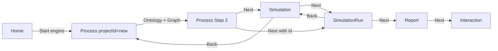

# MiroFish Frontend — Summary

The frontend is a **Vue 3** SPA (Vite, Vue Router) that implements the 5-step workflow: **Graph build → Environment setup → Start simulation → Report generation → Deep interaction**. It talks to the backend via **Axios** (proxy in dev to port 5001) and keeps minimal client state (e.g. pending upload in a small store).

---

## Entry point & layout

```
frontend/
├── index.html              # Single page, #app, script src main.js
├── vite.config.js          # Vue plugin, server port 3000, proxy /api → 5001
├── package.json            # vue, vue-router, axios, d3; vite, @vitejs/plugin-vue
├── public/
│   └── icon.png
├── src/
│   ├── main.js             # createApp(App), use(router), mount('#app')
│   ├── App.vue             # <router-view /> + global styles
│   ├── router/index.js     # Routes: Home, Process, Simulation, SimulationRun, Report, Interaction
│   ├── api/                # Axios instance + graph / simulation / report API wrappers
│   ├── store/              # pendingUpload.js (files + requirement before Process)
│   ├── views/              # Full-page views (one per route or step group)
│   ├── components/         # Step panels, GraphPanel, HistoryDatabase
│   └── assets/             # e.g. logo images
```

**Run:** `npm run dev` (from repo root: `npm run frontend`). App is at **http://localhost:3000**; `/api` is proxied to **http://localhost:5001**.

---

## Tech stack

| Category | Technology |
|----------|------------|
| Framework | Vue 3 (Composition API, `<script setup>`) |
| Router | Vue Router 4 (createWebHistory) |
| Build | Vite 7, @vitejs/plugin-vue |
| HTTP | Axios (baseURL from env or localhost:5001, 5min timeout) |
| Charts / viz | D3.js (graph visualization in GraphPanel) |

No Pinia/Vuex: only a small reactive store in `store/pendingUpload.js` for files and simulation requirement before the first API call.

---

## Routing (`src/router/index.js`)

| Path | Name | Component | Role |
|------|------|-----------|------|
| `/` | Home | Home | Landing, upload files + requirement, “Start engine” → Process with `projectId: 'new'` |
| `/process/:projectId` | Process | MainView | Step 1 (graph build) and Step 2 (env setup); `projectId` can be `'new'` or real ID |
| `/simulation/:simulationId` | Simulation | SimulationView | Step 2 UI continued (env setup) for an existing simulation |
| `/simulation/:simulationId/start` | SimulationRun | SimulationRunView | Step 3: run control, timeline, “Next” → report |
| `/report/:reportId` | Report | ReportView | Step 4: report content, generate/status, “Next” → interaction |
| `/interaction/:reportId` | Interaction | InteractionView | Step 5: chat with Report Agent, interview world agents |

Flow in short: **Home → Process (new) → [ontology + graph] → Process Step 2 or Simulation → SimulationRun → Report → Interaction.**

---

## API layer (`src/api/`)

### `index.js`

- **Axios instance:** `baseURL` from `import.meta.env.VITE_API_BASE_URL` or `http://localhost:5001`, timeout 300000 ms, default `Content-Type: application/json`.
- **Response interceptor:** If `res.success === false`, reject with `res.error` or message.
- **requestWithRetry(requestFn, maxRetries, delay):** Retries a request (exponential backoff) for transient failures.

### `graph.js`

- `generateOntology(formData)` — POST `/api/graph/ontology/generate` (multipart).
- `buildGraph(data)` — POST `/api/graph/build` (e.g. `project_id`).
- `getTaskStatus(taskId)` — GET `/api/graph/task/:taskId`.
- `getGraphData(graphId)` — GET `/api/graph/data/:graphId`.
- `getProject(projectId)` — GET `/api/graph/project/:projectId`.

### `simulation.js`

- `createSimulation(data)` — POST `/api/simulation/create`.
- `prepareSimulation(data)` — POST `/api/simulation/prepare`.
- `getPrepareStatus(data)` — POST `/api/simulation/prepare/status`.
- `getSimulation(simulationId)`, `listSimulations(projectId)`.
- `getSimulationProfiles(simulationId, platform)`, `getSimulationProfilesRealtime(...)`.
- `getSimulationConfig(simulationId)`, `getSimulationConfigRealtime(simulationId)`.
- `startSimulation(data)` — POST `/api/simulation/start`.
- `stopSimulation(data)` — POST `/api/simulation/stop`.
- `getRunStatus(simulationId)`, `getRunStatusDetail(simulationId)`.
- `getSimulationPosts`, `getSimulationTimeline`, `getAgentStats`, `getSimulationActions`.
- `interview(data)` — POST `/api/simulation/interview`.
- `getEnvStatus(data)` — POST `/api/simulation/env-status`.
- `closeSimulationEnv(data)` — POST `/api/simulation/close-env`.

### `report.js`

- `generateReport(data)` — POST `/api/report/generate`.
- `getReportStatus(reportId)` — GET report generate status.
- `getReport(reportId)` — GET `/api/report/:reportId`.
- `getAgentLog(reportId, fromLine)`, `getConsoleLog(reportId, fromLine)`.
- `chatWithReport(data)` — POST `/api/report/chat`.

---

## Store (`src/store/pendingUpload.js`)

Reactive state used only for the **Home → Process** handoff:

- `state.files` — array of File objects to upload.
- `state.simulationRequirement` — string.
- `state.isPending` — boolean.

**Methods:**

- `setPendingUpload(files, requirement)` — set and set `isPending = true`.
- `getPendingUpload()` — return `{ files, simulationRequirement, isPending }`.
- `clearPendingUpload()` — clear and set `isPending = false`.

Process page (MainView) reads this on load when `projectId === 'new'`, calls `generateOntology` with the stored files and requirement, then clears pending and replaces the route with the new `project_id`.

---

## Views (pages)

### Home (`views/Home.vue`)

- **Hero:** Tagline, “Upload any report / Predict the future now”, short description.
- **Dashboard:** System status, workflow steps list, **upload zone** (drag-and-drop or click; PDF/MD/TXT), **simulation prompt** textarea, “Start engine” button.
- **Logic:** On “Start engine”: `setPendingUpload(files, simulationRequirement)`, then `router.push({ name: 'Process', params: { projectId: 'new' } })`.
- **HistoryDatabase** at bottom: list of past projects/simulations (from API), click to open Process or Simulation/Report/Interaction.

### MainView (`views/MainView.vue`) — route: Process

- **Header:** Brand (link to `/`), view switcher (Graph / Split / Workbench), “Step X/5”, status.
- **Left panel:** **GraphPanel** — graph data, refresh, maximize; layout depends on `viewMode` (graph / split / workbench).
- **Right panel:** Step content:
  - **Step 1:** `Step1GraphBuild` — ontology progress, build progress, graph result, “Next” → Step 2.
  - **Step 2:** `Step2EnvSetup` — create simulation, prepare (profiles, config), “Back” / “Next” → navigate to Simulation or SimulationRun.
- **State:** `currentProjectId` (from route), `currentStep` (1 or 2), `projectData`, `graphData`, `ontologyProgress`, `buildProgress`, `systemLogs`. On mount, if `projectId === 'new'` then handle new project (get pending, call `generateOntology`, then `buildGraph` and poll task); else load project and graph.
- **Polling:** Task status and graph data poll until graph build completes.

### SimulationView (`views/SimulationView.vue`) — Step 2 continued

- Same layout as MainView (header + GraphPanel + right panel).
- **Right:** `Step2EnvSetup` with `simulationId` from route; can go back (close env, then navigate to Process) or “Next” → SimulationRun (with optional `maxRounds` in query).
- **Data:** Load project and graph by `simulationId` (from simulation API); refresh graph on interval.

### SimulationRunView (`views/SimulationRunView.vue`) — Step 3

- **Right:** `Step3Simulation` — start/stop simulation, run status, timeline/posts, “Back” (stop + navigate to Simulation) or “Next” (navigate to Report when report exists or trigger generate then go to Report).
- **State:** `maxRounds` from route query, `minutesPerRound`, project/graph/simulation data; optional graph refresh every 30s while simulating.

### ReportView (`views/ReportView.vue`) — Step 4

- **Right:** `Step4Report` — report content, generate/status, download, “Next” → Interaction.
- **Data:** Load report by `reportId`; resolve `simulationId` and then project/graph for GraphPanel.

### InteractionView (`views/InteractionView.vue`) — Step 5

- **Right:** `Step5Interaction` — chat with Report Agent, interview world agents, survey tools.
- **Data:** Same as ReportView (report + simulation + project + graph for left panel).

---

## Components

### GraphPanel (`components/GraphPanel.vue`)

- **Props:** `graphData`, `loading`, `currentPhase`, `isSimulating` (optional).
- **Behavior:** Renders force-directed graph with **D3.js** (nodes, edges, labels); click node/edge to show detail panel (name, UUID, attributes, summary, etc.); “Refresh” emits `refresh`, “Maximize” emits `toggle-maximize`.
- **Hints:** “Updating...” when building or simulating; “Simulation finished” hint with dismiss.

### Step1GraphBuild (`components/Step1GraphBuild.vue`)

- **Props:** `currentPhase`, `projectData`, `ontologyProgress`, `buildProgress`, `graphData`, `systemLogs`.
- **Emits:** `next-step`.
- **UI:** Step 01 Ontology (API note, progress, entity/relation tags with click-to-detail), Step 02 Graph build (progress bar, result counts), “Next” when graph complete. No direct API calls; parent (MainView) does ontology + build and polling.

### Step2EnvSetup (`components/Step2EnvSetup.vue`)

- **Props:** `simulationId` (optional), `projectData`, `graphData`, `systemLogs`.
- **Emits:** `go-back`, `next-step`, `add-log`, `update-status`.
- **UI:** Step 01 Create simulation (POST create, show simulation_id), Step 02 Prepare (POST prepare, poll prepare status, show profiles count and list preview), Step 03 Config (realtime config), “Back” / “Next”. Calls `createSimulation`, `prepareSimulation`, `getPrepareStatus`, etc. “Next” can pass `maxRounds` and navigate to `/simulation/:id/start?maxRounds=...`.

### Step3Simulation (`components/Step3Simulation.vue`)

- **Props:** `simulationId`, `maxRounds`, `minutesPerRound`, `projectData`, `graphData`, `systemLogs`.
- **Emits:** `go-back`, `next-step`, `add-log`, `update-status`.
- **UI:** Start/Stop simulation, run status, timeline or posts, “Back” (stop + close env) or “Next” (report generate or open Report by reportId). Uses `startSimulation`, `stopSimulation`, `getRunStatus`, `getSimulationTimeline`, report generate + status.

### Step4Report (`components/Step4Report.vue`)

- **Props:** `reportId`, `simulationId`, `systemLogs`.
- **Emits:** `add-log`, `update-status`.
- **UI:** Report sections, generate button, status polling, download; “Next” → navigate to `/interaction/:reportId`. Uses `getReport`, `generateReport`, report status, download.

### Step5Interaction (`components/Step5Interaction.vue`)

- **Props:** `reportId`, `simulationId`, `systemLogs`.
- **Emits:** `add-log`, `update-status`.
- **UI:** Tabs: chat with Report Agent, interview single agent, send survey to world. Uses `chatWithReport`, simulation `interview` (and batch/all), report tools if exposed.

### HistoryDatabase (`components/HistoryDatabase.vue`)

- **Data:** Fetches project/simulation list (e.g. from backend list endpoints) and shows cards (simulation_id, project_id, report_id, files, requirement snippet).
- **Behavior:** Click card → navigate to Process (by project_id) or Simulation/Report/Interaction depending on what exists. Used on Home.

---

## User flow (summary)



1. **Home:** Upload files + requirement → “Start engine” → store pending → go to Process with `projectId: 'new'`.
2. **Process (new):** Read pending → POST ontology/generate → POST build → poll task → poll graph → show Step 1 then Step 2; “Next” from Step 2 → go to Simulation or SimulationRun (with simulationId).
3. **Simulation:** Step 2 UI for that simulation; “Next” → SimulationRun (optional query maxRounds).
4. **SimulationRun:** Start/stop run, see status/timeline; “Next” → ensure report exists (generate if needed) → go to Report.
5. **Report:** View/download report; “Next” → Interaction.
6. **Interaction:** Chat and interview; no mandatory “Next”.

---

## Frontend–backend mapping (by step)

| Step | Frontend route / view | Main API used |
|------|------------------------|---------------|
| 1 | Process (MainView) + Step1GraphBuild | POST ontology/generate, POST build, GET task/status, GET project, GET data/graphId |
| 2 | Process Step 2 or SimulationView + Step2EnvSetup | POST simulation/create, POST simulation/prepare, GET prepare/status, GET simulation |
| 3 | SimulationRunView + Step3Simulation | POST simulation/start, POST simulation/stop, GET run-status, GET timeline/posts, POST report/generate |
| 4 | ReportView + Step4Report | GET report, POST report/generate, GET report generate/status |
| 5 | InteractionView + Step5Interaction | POST report/chat, POST simulation/interview |

---

## Environment

- **Dev:** Vite proxy sends `/api` to `http://localhost:5001` (see `vite.config.js`).
- **API base URL:** `import.meta.env.VITE_API_BASE_URL` in `api/index.js`; if unset, uses `http://localhost:5001`.

---

## Summary: where is what?

| What | Where |
|------|--------|
| App shell, global styles | `App.vue` |
| Routes | `src/router/index.js` |
| Axios instance, retry | `src/api/index.js` |
| Graph API | `src/api/graph.js` |
| Simulation API | `src/api/simulation.js` |
| Report API | `src/api/report.js` |
| Pending upload store | `src/store/pendingUpload.js` |
| Landing, upload, history | `views/Home.vue`, `components/HistoryDatabase.vue` |
| Step 1 & 2 (process) | `views/MainView.vue`, `Step1GraphBuild.vue`, `Step2EnvSetup.vue` |
| Step 2 (by simulation) | `views/SimulationView.vue` |
| Step 3 | `views/SimulationRunView.vue`, `Step3Simulation.vue` |
| Step 4 | `views/ReportView.vue`, `Step4Report.vue` |
| Step 5 | `views/InteractionView.vue`, `Step5Interaction.vue` |
| Graph D3 viz | `components/GraphPanel.vue` |

This document summarizes how the whole frontend is structured and how it works end-to-end.
