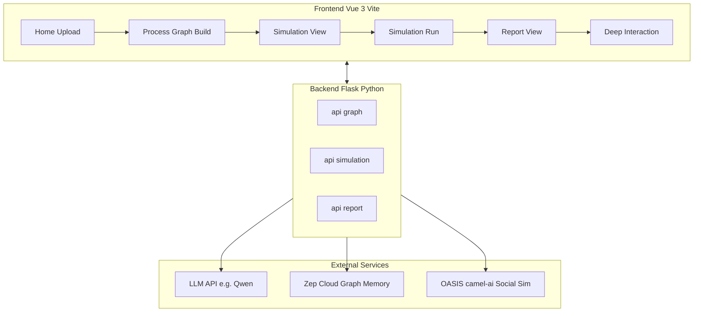
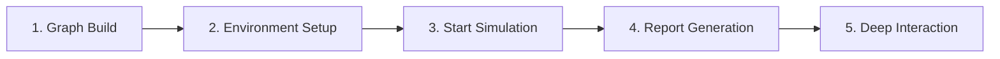
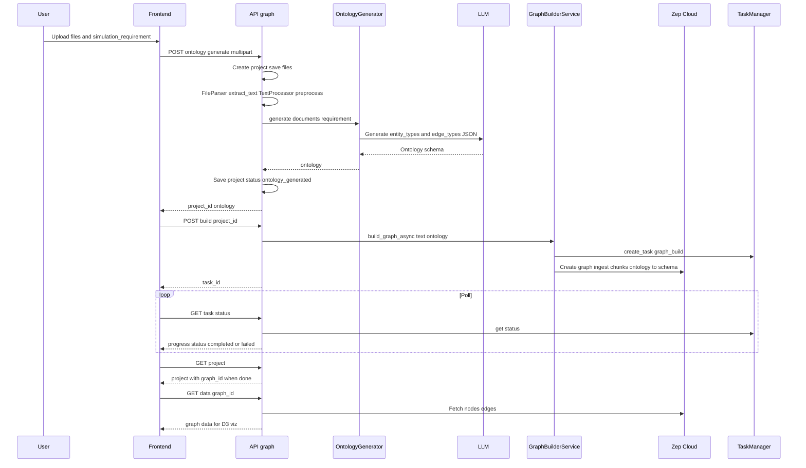
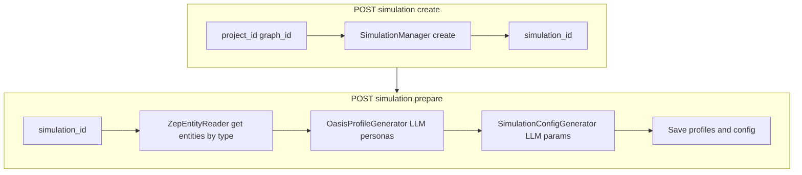
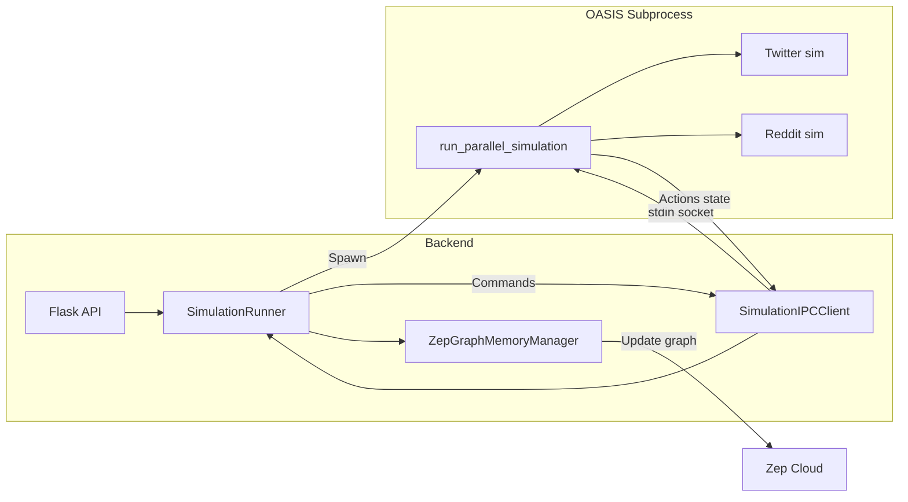
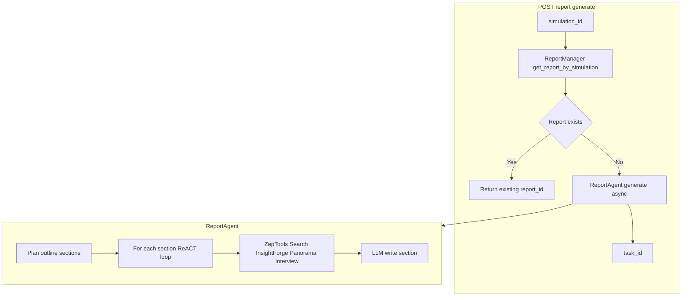
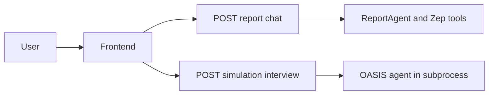
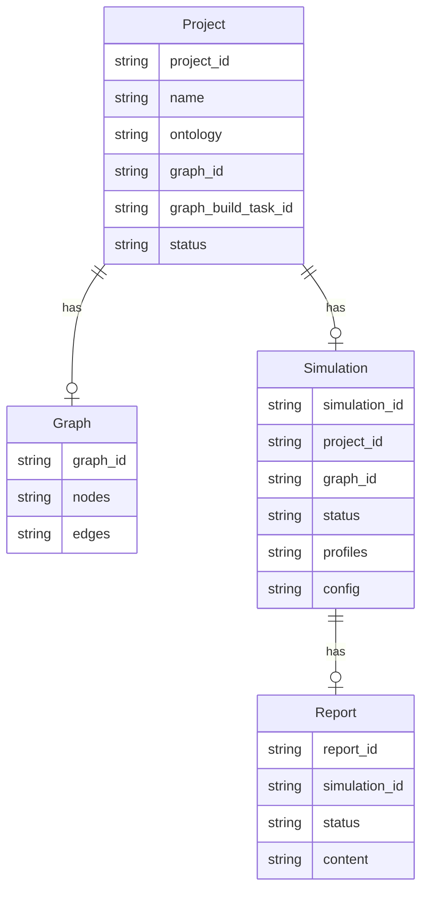

# MiroFish Project Overview

**MiroFish** is a multi-agent AI prediction engine. It takes real-world “seed” data (e.g. reports, news, policy drafts), builds a high-fidelity knowledge graph, and runs a parallel social simulation with many agents that have personas, memory, and behavior. You can then generate prediction reports and interact with the simulated world.

- **Input:** Upload documents (PDF/MD/TXT) + a natural-language simulation/prediction requirement.
- **Output:** A detailed prediction report and an interactive simulated world (chat with agents, inspect graph).

---

## High-Level Architecture

---

## End-to-End Logic Flow

The product is organized into **5 steps**. Data flows from graph build → environment setup → simulation run → report generation → deep interaction.

---

## Step 1: Graph Build (Knowledge Graph)

**Goal:** Turn uploaded documents into a **project** with an **ontology** (entity/relation types) and a **Zep knowledge graph** (nodes = entities, edges = relations).

**Key backend pieces:**

| Component | Role |
|-----------|------|
| `OntologyGenerator` | Calls LLM to produce `entity_types` and `edge_types` from documents + requirement. |
| `GraphBuilderService` | Chunks text, sends to Zep Cloud to create a graph that matches the ontology. |
| `ProjectManager` | In-memory (or persisted) project state: `project_id`, `ontology`, `graph_id`, `graph_build_task_id`. |
| `TaskManager` | Tracks async graph build; frontend polls until completed/failed. |

---

## Step 2: Environment Setup (Simulation Prep)

**Goal:** Create a **simulation** for a project/graph, then **prepare** it: read entities from Zep, generate **OASIS agent profiles**, and generate **simulation config** (rounds, platform settings, etc.).

**Flow in more detail:**

1. **Create:** `POST /api/simulation/create` with `project_id` and `graph_id` → `SimulationManager` creates a `SimulationState` (e.g. `sim_xxx`).
2. **Prepare:** `POST /api/simulation/prepare` with `simulation_id`:
   - **ZepEntityReader** loads entities (and optional edges) from Zep for the graph; filter by ontology entity types.
   - **OasisProfileGenerator** uses LLM to turn each entity into an **OASIS agent profile** (name, role, style, etc.).
   - **SimulationConfigGenerator** uses LLM to produce simulation parameters (rounds, time per round, platform toggles, etc.) from the project’s simulation requirement.
   - State is updated (e.g. `preparing` → `ready`).

---

## Step 3: Start Simulation (OASIS Run)

**Goal:** Run the **OASIS** social simulation (Twitter + Reddit) in a **subprocess**, drive it via **IPC**, and optionally **write back** agent actions into Zep graph memory.

**Flow:**

1. Frontend calls `POST /api/simulation/start` with `simulation_id` and e.g. `max_rounds`.
2. **SimulationRunner** starts the OASIS script (e.g. `run_parallel_simulation.py`) as a subprocess, passing config (profiles, graph, rounds, etc.).
3. **SimulationIPCClient** sends commands (e.g. stop, get status) and receives run status / actions / timeline.
4. **ZepGraphMemoryManager** can persist agent actions (e.g. posts, likes) back into Zep for later report/retrieval.
5. Frontend polls `GET /api/simulation/<simulation_id>/run-status` (and optionally actions/timeline) until run is completed or stopped.

**Relevant APIs:**

- `POST /api/simulation/start` — start run.
- `POST /api/simulation/stop` — request stop (IPC to subprocess).
- `GET /api/simulation/<id>/run-status` — current run state.
- `GET /api/simulation/<id>/actions`, `.../timeline`, `.../posts`, `.../comments` — inspect what agents did.

---

## Step 4: Report Generation

**Goal:** After a simulation run, generate a **report** (e.g. analysis, predictions) using a **Report Agent** that can use **Zep tools** (search, insight, panorama, interview) over the graph and simulation data.

**Flow:**

1. Frontend calls `POST /api/report/generate` with `simulation_id`.
2. **ReportManager** checks if a report for this simulation already exists; if so, returns `report_id`.
3. Otherwise **ReportAgent** runs (async): plans sections, then for each section uses **ZepToolsService** (GraphRAG search, InsightForge, PanoramaSearch, Interview) and LLM to write content.
4. Frontend polls `POST /api/report/generate/status` with `task_id` until report is ready, then uses `GET /api/report/<report_id>` and optionally `GET /api/report/<report_id>/download`.

---

## Step 5: Deep Interaction

**Goal:** Let the user **chat with the Report Agent** (about the report) and **interview agents** in the simulated world.

- **Report chat:** `POST /api/report/chat` with `report_id` and user message → Report Agent (with access to Zep tools) replies.
- **Interview:** `POST /api/simulation/interview` with `simulation_id`, `entity_uuid` (or agent id), and message → backend forwards to the running (or restarted) OASIS process so the corresponding agent answers.

---

## Data Model (Conceptual)

- **Project:** Created at Step 1; holds ontology, graph_id after build, and list of simulations.
- **Graph:** Stored in Zep; referenced by `graph_id`; used for entities, report tools, and (optionally) memory updates.
- **Simulation:** Created in Step 2; holds OASIS profiles and config; one run per simulation (runner process).
- **Report:** One per simulation (or reused); generated in Step 4; used in Step 5 for chat.

---

## API Summary

| Area | Prefix | Main endpoints |
|------|--------|----------------|
| **Graph / Project** | `/api/graph` | `POST /ontology/generate`, `POST /build`, `GET /project/<id>`, `GET /data/<graph_id>`, `GET /task/<task_id>/status` |
| **Simulation** | `/api/simulation` | `POST /create`, `POST /prepare`, `POST /start`, `POST /stop`, `GET /<id>/run-status`, `GET /<id>/actions`, `POST /interview` |
| **Report** | `/api/report` | `POST /generate`, `POST /generate/status`, `GET /<report_id>`, `POST /chat`, `GET /<report_id>/download` |

---

## Tech Stack

| Layer | Technology |
|-------|------------|
| Frontend | Vue 3, Vue Router, Vite, Axios, D3.js |
| Backend | Python 3.11+, Flask, Flask-CORS |
| LLM | OpenAI-compatible API (e.g. Qwen) |
| Graph & memory | Zep Cloud |
| Social simulation | OASIS / camel-ai (Twitter + Reddit scripts) |
| Package management | npm (frontend), uv (backend) |

---

## Where to Look in the Repo

| What you need | Where to look |
|---------------|----------------|
| Graph build (ontology + Zep graph) | `backend/app/api/graph.py`, `services/ontology_generator.py`, `services/graph_builder.py` |
| Simulation lifecycle | `backend/app/api/simulation.py`, `services/simulation_manager.py`, `services/simulation_runner.py`, `services/oasis_profile_generator.py`, `services/simulation_config_generator.py` |
| Report generation & chat | `backend/app/api/report.py`, `services/report_agent.py`, `services/zep_tools.py` |
| Zep entities / memory | `services/zep_entity_reader.py`, `services/zep_graph_memory_updater.py` |
| Frontend steps | `frontend/src/views/` (Process, SimulationView, SimulationRunView, ReportView, InteractionView) |

This document and the diagrams describe how the system works end-to-end and where the main logic lives.
