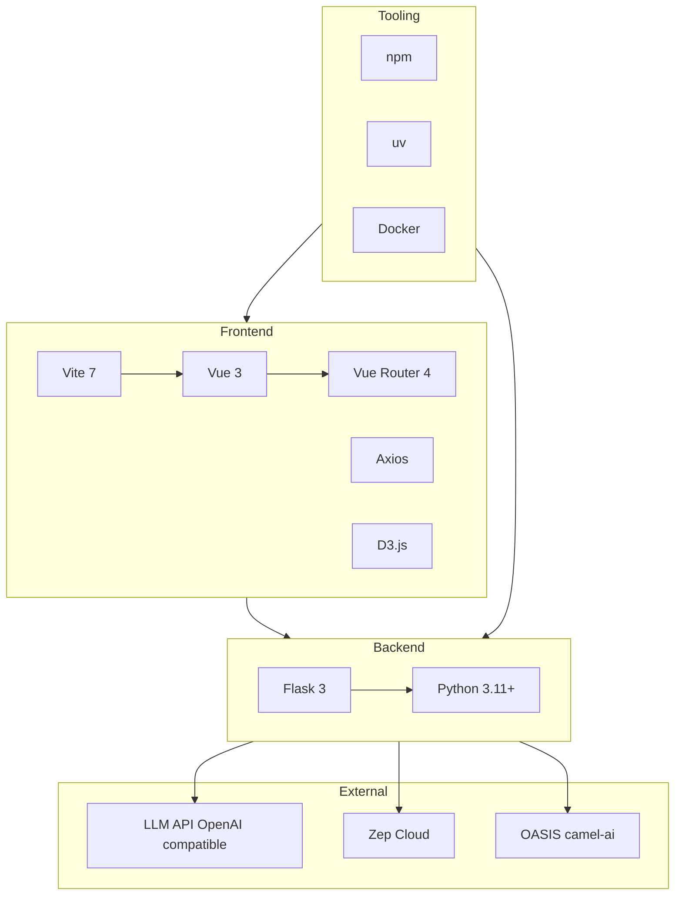

# MiroFish — Technology Stack

Summary of all technologies used in the MiroFish project: frontend, backend, external services, and tooling.

---

## Overview

| Layer | Stack | Purpose |
|-------|--------|---------|
| **Frontend** | Vue 3, Vite, Vue Router, Axios, D3.js | SPA for upload, graph build, simulation, report, interaction |
| **Backend** | Python 3.11+, Flask, uv | REST API, ontology/graph/simulation/report logic |
| **LLM** | OpenAI-compatible API (e.g. Qwen) | Ontology, profiles, config, report generation |
| **Graph & memory** | Zep Cloud | Knowledge graph, entity/relation storage, retrieval |
| **Simulation** | OASIS / camel-ai | Twitter + Reddit agent simulation (subprocess) |
| **Package & run** | npm, uv, concurrently, Docker | Dependencies and dev/production run |

---

## Frontend

| Category | Technology | Version | Use |
|----------|------------|---------|-----|
| **Framework** | Vue | 3.x | Composition API, `<script setup>`, reactive UI |
| **Router** | Vue Router | 4.x | SPA routes (Home, Process, Simulation, Report, Interaction) |
| **Build** | Vite | 7.x | Dev server (port 3000), HMR, production build |
| **Plugin** | @vitejs/plugin-vue | 6.x | Vue SFC support in Vite |
| **HTTP** | Axios | 1.x | API client; proxy `/api` → backend in dev |
| **Visualization** | D3.js | 7.x | Force-directed graph (nodes/edges) in GraphPanel |

**Root package (repo root):**

- **concurrently** — Run backend and frontend in one terminal (`npm run dev`).
- **Node** — `>=18.0.0` (see `package.json` engines).

**No state library** — Only a small reactive store in `store/pendingUpload.js` (no Pinia/Vuex).

---

## Backend

| Category | Technology | Version | Use |
|----------|------------|---------|-----|
| **Runtime** | Python | ≥3.11, &lt;3.13 | Backend runtime |
| **Web** | Flask | ≥3.0 | App factory, blueprints, REST endpoints |
| **CORS** | Flask-CORS | ≥6.0 | Allow frontend origin |
| **LLM client** | openai | ≥1.0 | OpenAI-compatible API (Qwen, etc.) |
| **Graph / memory** | zep-cloud | 3.13.0 | Zep Cloud client (graph, entities, search) |
| **Simulation** | camel-oasis, camel-ai | 0.2.x, 0.2.x | OASIS social simulation (Twitter, Reddit) |
| **PDF** | PyMuPDF | ≥1.24 | Extract text from PDF |
| **Encoding** | charset-normalizer, chardet | 3.x, 5.x | Detect encoding for non-UTF-8 text |
| **Config** | python-dotenv | ≥1.0 | Load `.env` from project root |
| **Validation** | pydantic | ≥2.0 | Data validation where used |
| **Build** | hatchling | — | Wheel build in pyproject.toml |

**Package manager:** **uv** (install/sync in `backend/`).

**Dev (optional):** pytest, pytest-asyncio, pipreqs.

---

## External services

| Service | Role | Config (env) |
|---------|------|--------------|
| **LLM API** | Ontology generation, agent profiles, simulation config, report text | `LLM_API_KEY`, `LLM_BASE_URL`, `LLM_MODEL_NAME`. Supported: **OpenAI** (e.g. `gpt-4o-mini`, default in `.env.example`) or **Alibaba Bailian** (`qwen-plus`). See `.env.example` for both options. |
| **Graph backend** | Knowledge graph and memory (choose one) | **Zep:** `GRAPH_BACKEND=zep`, `ZEP_API_KEY`. **Neo4j:** `GRAPH_BACKEND=neo4j`, `NEO4J_URI`, `NEO4J_USER`, `NEO4J_PASSWORD`. See `.env.example`. |

**OASIS** runs as a **local subprocess** (no separate cloud); it uses the same LLM and the configured graph backend.

### Using Neo4j instead of Zep

**Supported.** Set `GRAPH_BACKEND=neo4j` and provide `NEO4J_URI`, `NEO4J_USER`, `NEO4J_PASSWORD`. The app uses an abstraction (`IGraphBackend`); implementations are **ZepGraphBackend** (Zep Cloud) and **Neo4jGraphBackend** (Neo4j with LLM-based entity/relation extraction for ingest). Search is full-text (CONTAINS) on Neo4j; Zep uses semantic search when available.

---

## Development & operations

| Tool | Use |
|------|-----|
| **npm** | Root and frontend dependencies; scripts: `setup`, `setup:all`, `dev`, `backend`, `frontend`, `build` |
| **uv** | Backend Python deps and venv (`cd backend && uv sync`); run: `uv run python run.py` |
| **concurrently** | `npm run dev` runs backend + frontend together |
| **Docker** | Optional: `docker compose up -d` (image `ghcr.io/666ghj/mirofish:latest`), ports 3000 + 5001, volume for `backend/uploads` |

**Ports:**

- Frontend (Vite): **3000**
- Backend (Flask): **5001**

**Env file:** `.env` at **project root**; backend loads it via `python-dotenv` (see `backend/app/config.py`).

---

## Stack diagram

---

## Quick reference

| What | Where / command |
|------|------------------|
| Frontend deps | `frontend/package.json` |
| Backend deps | `backend/pyproject.toml` |
| Root scripts | Root `package.json` (setup, dev, backend, frontend, build) |
| Backend config | `backend/app/config.py`, root `.env` |
| Run all (dev) | `npm run dev` (backend + frontend) |
| Run backend only | `npm run backend` or `cd backend && uv run python run.py` |
| Run frontend only | `npm run frontend` or `cd frontend && npm run dev` |
| Production build | `npm run build` (builds frontend) |
| Docker | `docker compose up -d` (uses root `.env`) |

---

## License

Project license: **AGPL-3.0** (see root and backend package files).
